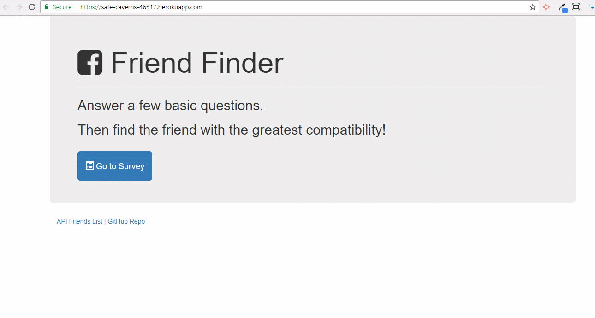

# FriendFinder
In this application, a user can fill up a survey and based on their responses, he/she will be suggested who will be closest match! 
The main logic to recommend which friend is most compatible, is coded in <b>/app/routing/apiRoutes.js</b> file in the POST listener section @ the ("/api/friends") route. 
I deployed this app to Heroku as well and please see the gif below to showcase what I developed 

